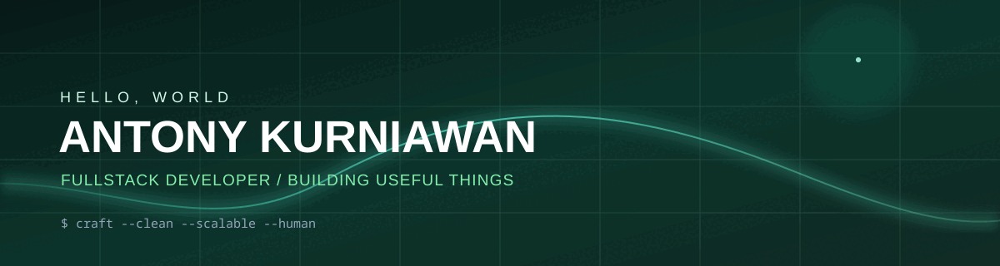

<div align="center">
  
</div>

<br />

<div align="center">
  <a href="https://github.com/VoinzzZ"></a>
  <!-- Tambahkan LinkedIn, portfolio, atau email Anda di sini bila sudah siap. -->
</div>

## About Me

```ts
const antony = {
  role: "Fullstack Developer",
  location: "Surabaya, Indonesia",
  focus: ["Clean architecture", "Scalable backend systems", "Smooth user experiences"],
  currentlyBuilding: "Useful things for the web",
};
```

- 🔭 Exploring better ways to build products that feel simple and work reliably.
- 🌱 Continuously learning about modern web development and backend architecture.
- 💬 Open to remote and local WFO opportunities.

## My Digital Toolbox

<div align="center">
  
</div>

## GitHub, at a Glance

<div align="center">
  
  
</div>

<div align="center">
  
</div>

## Connect Across the Multiverse

<div align="center">
  <a href="https://github.com/VoinzzZ">
    
  </a>
</div>

<br />

<div align="center">
  <sub>Made with curiosity, coffee, and a little bit of code.</sub>
</div>
